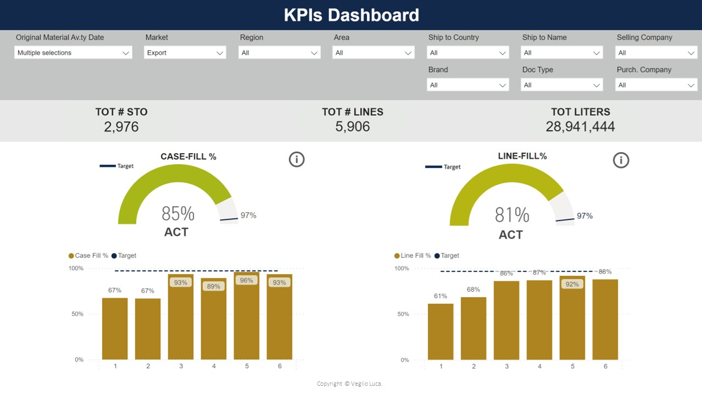
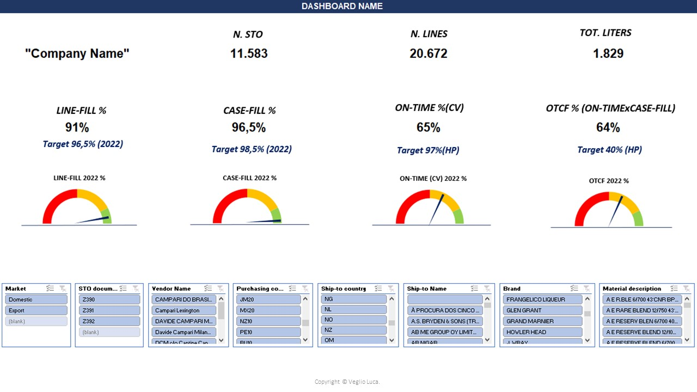
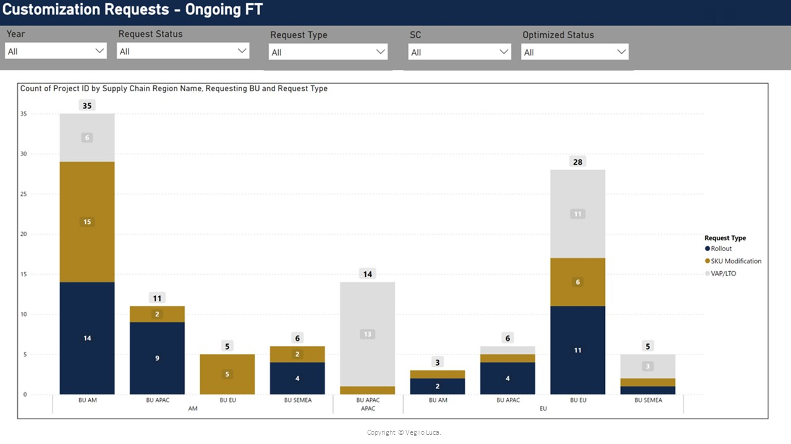
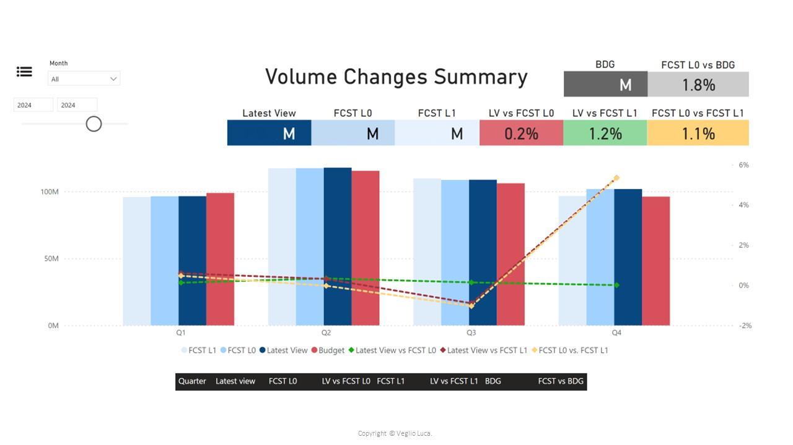

#### Professional Summary
Dynamic professional with over 5 years of experience in data analysis and business intelligence within the FMCG sector. Proven expertise in deriving actionable insights from complex data sets and enhancing decision-making processes through advanced data visualization and analytics tools. Skilled in SAP, Power BI, and Excel, with a strong quantitative background and a solid foundation in Economics and Informatics. Able in managing analytics projects from start to completion, fostering a data-driven culture, and delivering impactful storytelling presentations.

## Work Experience
**Liquid Planner @ Campari Group (_May 2021 - Present_)**

- Analyzed and integrated data from various software (SAP, TMS, WHMS). Design ETL pipeline from SAP, aggregating data from internal and 3rd party tools and loaded into user friendly dashboards.

- Deliver monthly tailored reports to provide insights and evaluate the performance related with specific projects from Demand Planning, Business Development and Sales.

- Responsible for Inventory and Production Volume control for 11 brands (Aperol, Averna, Riccadonna, Mondoro, Frangelico, Bankes-Bickens, Braulio, XRated, Sarti Rosa, Diesus, Spritz) in Canale’s plant and 2 external co-manufacturing in Italy.

- Led cross-functional project teams achieving an 11% annual production volume increase for Aperol brand within our budget expectations.

**Winery Retail Supervisor @ “Veglio Romano & Lorenzo” Winery (_June 2018 - April 2021_)**

- Created and optimized an Excel database for inventory management based on sales forecasts, product type, and production year.

- Enhanced customer database segmentation (300+ clients) for improved offer personalization.

## Projects Portfolio
### Sales Analysis

### Shipping Analysis

### Customer Service Analysis

### Production Volumes

